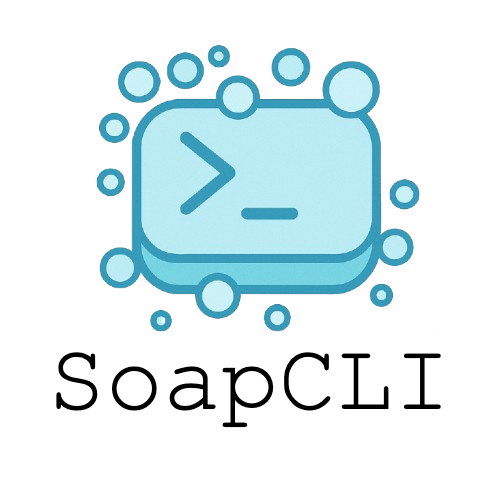

# SoapCLI

<p align="center">
  
</p>

`SoapCLI` is a small, dependency-light command line tool for sending SOAP requests over HTTP/HTTPS.

It is designed to be:

- **Simple** – single JAR, straightforward options.
- **Script-friendly** – works well in shell scripts and CI pipelines.
- **Flexible** – supports HTTPS with client certificates and configurable profiles.

If you find this tool useful and want to say thanks, you can buy me a coffee via PayPal:

<p align="center">
  <a href="https://www.paypal.com/paypalme/marcemv90/2" target="_blank">
    
  </a>
</p>

---

## Quick start

### Build

```bash
mvn clean package
```

This produces `target/SoapCLI.jar` which includes all dependencies.

### Run

```bash
java -jar target/SoapCLI.jar --help
```

### Example call

```bash
java -jar SoapCLI.jar --endpoint https://example.com/soap --request-file request.xml
```

---

## Documentation

Full documentation (usage, options, profiles, examples, etc.) is available on GitHub Pages:

https://marcemv90.github.io/SoapCLI/

### Installation docs

For detailed installation and build-from-source instructions, see the **Installation** section in the documentation site.

The site is built from the `docs/` folder using [MkDocs](https://www.mkdocs.org/) with the [Material for MkDocs](https://squidfunk.github.io/mkdocs-material/) theme and is deployed automatically by a GitHub Actions workflow at `.github/workflows/gh-pages.yml`.

### Previewing documentation locally with Docker

You can run the MkDocs development server via Docker using the provided `Dockerfile.docs`:

```bash
docker build -f Dockerfile.docs -t soapcli-docs .
docker run --rm -p 8000:8000 -v "$(pwd)":/docs soapcli-docs
```

Then open http://localhost:8000/ in your browser to preview the documentation.

---

## DISCLAIMER

This project is being developed by a monkey with a shotgun (me) with the help of an AI agent. It is your responsibility to test the code and ensure it works as expected in your environment before using it in production or critical systems.
