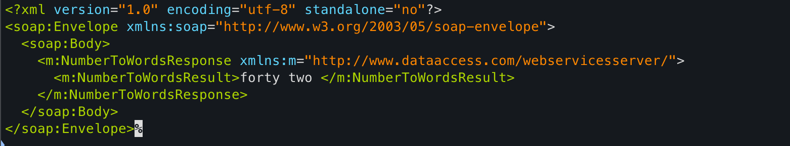
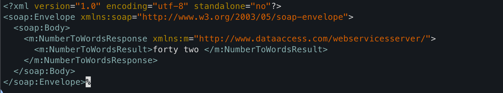
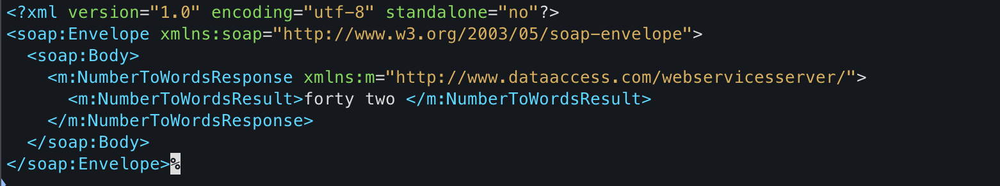
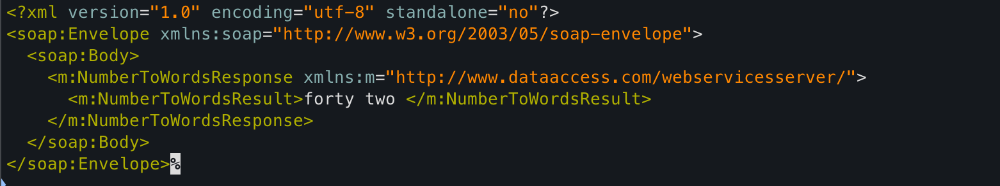
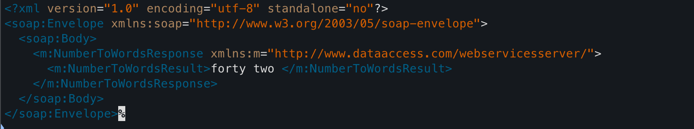
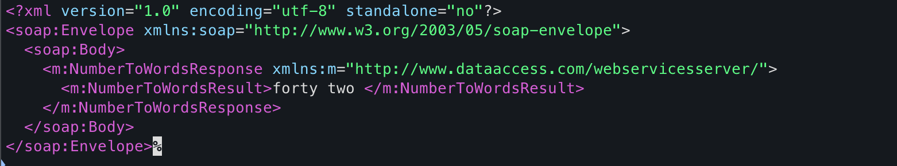
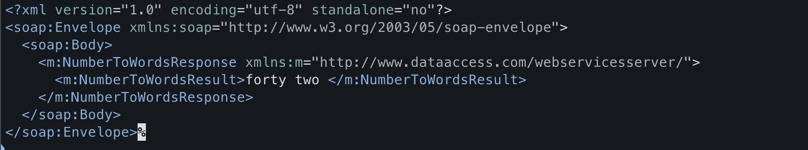

# Themes

`SoapCli` can colorize XML responses using different syntax highlighting themes. You choose the theme with the `--theme` flag or via profiles.

## Using themes on the CLI

```console
java -jar SoapCLI.jar \
  --endpoint https://example.com/soap \
  --request-file request.xml \
  --theme dracula
```

If no theme is specified (via CLI or profile), the default is `darcula`.

## Using themes in profiles

In a profiles JSON file you can set a default theme per profile using the `theme` field:

```json
{
  "profiles": {
    "acceptance": {
      "endpoint": "https://acceptance.example.com/soap",
      "requestFile": "requests/acceptance-default.xml",
      "theme": "nord"
    }
  }
}
```

When you run with `--profile acceptance`, the `nord` theme is applied unless overridden by `--theme` on the CLI.

## Available themes

These themes are built in:

!!! note
    The exact look of each theme depends on the color palette configured in your terminal client. If your terminal overrides or customizes ANSI colors, the screenshots and colors you see may differ slightly.

**Monokai (`--theme monokai`)**

   

**Solarized Dark (`--theme solarized-dark`)** 

   

**Solarized Light (`--theme solarized-light`)** 

   

**Darcula (`--theme darcula`)** 

   

**Gruvbox Dark (`--theme gruvbox-dark`)** 

   

**Gruvbox Light (`--theme gruvbox-light`)** 

   

**Dracula (`--theme dracula`)** 

   

**Nord (`--theme nord`)** 

   
